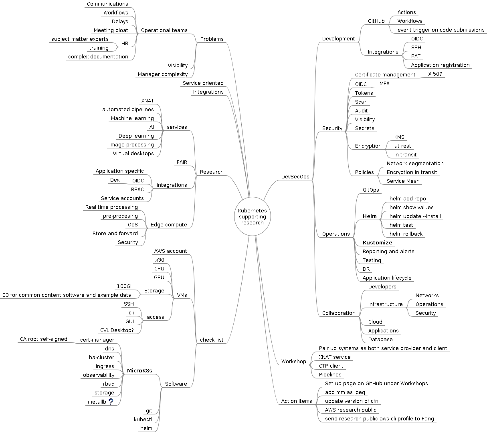

## Introduction

## Terms and concepts from our perspective

* [Kubernetes](https://sydneyresearchtech.github.io/infra/k8s.html)
* Cloud
* Simple - really meaning `managed complexity`

## Very brief Kubernetes at high level

* [Kubernetes Components](https://kubernetes.io/docs/concepts/overview/components/)
  * Control plane
    * API server
    * etcd
  * Node components
    * kubelet - makes sure that containers are running in a Pod
    * kube-proxy - network proxy that runs on each node
    * Container runtime - run containers
      * CRI - Container Runtime Interface
      * e.g., containerd

## Minimum host machine specs

* Recommendation: use the VM provided by the instructor. This will help to ensure the machine has been tested to work with the content.

|      | min. spec |
| ---  | ---       |
| RAM  | 8 Gi      |
| vCPU | 2         |
| HDD  | 100 GB    |

## Notes for instructors

* Print out the details bellow and distribute to attendees to speed up setup
  * Machine DNS or IP address for connection
  * Password set up for workshop
  * Quick Start guide outlining how to connect and access the GUI. Both Windows and Mac clients should be included as a minimum.
* Verify cloud resource is available to support ec2 instance numbers
  * `aws service-quotas get-service-quota --service-code ec2 --quota-code L-3819A6DF`
  * NB: Measured in vCPUs - g4dn.xlarge - 4x vCPU ea - 4x 24 participants = 96 vCPUs
* Verify access to VM using password from the workshop location to ensure unhindered access

## Design highlights

## Getting started

Your instructor will provide the following
* AWS EC2 instance
  * DNS address to host
  * Initial password to the default `ubuntu` user account

```bash
ssh -Llocalhost:63389:localhost:3389 ubuntu@MACHINE_NAME.ap-southeast-2.compute.amazonaws.com

tmux
```

```bash
# Install Kubernetes
sudo snap install microk8s --classic
sudo usermod -a -G microk8s ubuntu

# Add client tools
sudo snap install kubectl --classic
echo 'source <(kubectl completion bash)' >>~/.bashrc

sudo snap install helm --classic
echo 'source <(helm completion bash)' >>~/.bashrc

mkdir -p $HOME/.local/bin
mkdir -p $HOME/.kube

# calicoctl
curl -L https://github.com/projectcalico/calico/releases/download/v3.25.0/calicoctl-linux-amd64 -o $HOME/.local/bin/calicoctl
chmod +x $HOME/.local/bin/calicoctl

# Log out and back in
# This will load all the environment changes into your new active shell.

# Setup kubectl with microk8s cluster configuration
(umask 0077; microk8s config > $HOME/.kube/config)

# Whats happened
microk8s status
kubectl get nodes
kubectl get pod --all-namespaces

# Notice Calico virutal network interfaces
ip addr

# View default Calico IP pod address allocation pool
calicoctl get ippool
```

## Getting to know your Kubernetes cluster

```bash
kubectl version
kubectl cluster-info dump |less
kubectl api-resources
```

Internal DNS
* [DNS for Services and Pods](https://kubernetes.io/docs/concepts/services-networking/dns-pod-service/)
  
```bash
# The default namespace 'default' is used if namespace is not specified
kubectl run testmachine --image=ubuntu:latest -- tail -f /dev/null
kubectl get pod
kubectl exec -it testmachine -- bash
```

```bash
# In the container shell
# Internal cluster DNS configuration
cat /etc/resolv.conf

# Kubernetes as a process watchdog (systemd) NB: PID 1
ps aux

apt update
apt -y install dnsutils
dig google.com.au
```

Covered
* Microk8s basics
* Kubernetes cluster overview
* Internal DNS and service naming convention
* Getting adhoc development and testing pods

# Kubernetes add-ons

## Role Based Access Control (RBAC)

```bash
microk8s enable rbac
kubectl api-resources
```

## Observability

```bash
microk8s enable observability

kubectl --namespace observability get pods -l "release=kube-prom-stack"

kubectl port-forward service/kube-prom-stack-grafana 8080:80

# Using the browser
# Address: http://localhost:8080
# Username: admin
# Password: prom-operator
```

### Persistence, Storage classes, Volumes

* [Persistent volumes](https://kubernetes.io/docs/concepts/storage/persistent-volumes/)

```bash
microk8s enable hostpath-storage
kubectl get sc

cat <<EOT |kubectl create -f -
apiVersion: v1
kind: PersistentVolumeClaim
metadata:
  name: my-first-pvc
spec:
  accessModes:
    - ReadWriteOnce
  resources:
    requests:
      storage: 5Gi
  volumeMode: Filesystem
  storageClassName: microk8s-hostpath
EOT

kubectl get pvc
kubectl descibe pvc my-first-pvc
```

Create a PVC consumer

```bash
cat <<EOT |kubectl apply -f -
apiVersion: v1
kind: Pod
metadata:
  name: my-first-pod
  labels:
    app.kubernetes.io/name: my-first-pod
spec:
  containers:
    - name: basic-web
      image: nginx
      ports:
        - containerPort: 80
          name: http-web-svc
      volumeMounts:
        - mountPath: /var/www/html
          name: my-first-pvc
  volumes:
    - name: my-first-pvc
      persistentVolumeClaim:
        claimName: my-first-pvc
EOT

watch kubectl get pod
kubectl describe pod my-first-pod
kubectl logs my-first-pod

kubectl get pvc,pv
```

NB extra details for later:
* Label and selectors
* container ports

### Services, Ingress and Load balancers

```bash
microk8s enable ingress
kubectl get pod --all-namespaces
kubectl api-resources
kubectl get ingressclasses

curl localhost:80
```

Add a HTTP service to 'my-first-pod'

```bash
cat <<EOT |kubectl apply -f -
apiVersion: v1
kind: Service
metadata:
  name: my-first-service
spec:
  selector:
    app.kubernetes.io/name: my-first-pod
  ports:
    - protocol: TCP
      port: 80
      targetPort: 80
EOT

kubectl port-forward service/my-first-service 8080:80

# Open another terminal 
curl localhost:8080
```

Add an Ingress to 'my-first-pod'

* [Ingress](https://kubernetes.io/docs/concepts/services-networking/ingress/)
* [ingress-nginx](https://github.com/kubernetes/ingress-nginx)

```bash
cat <<EOT |kubectl apply -f -
apiVersion: networking.k8s.io/v1
kind: Ingress
metadata:
  name: my-first-ingress
spec:
  ingressClassName: nginx
  rules:
  - host: "mywebservice.local"
    http:
      paths:
      - path: /
        pathType: Prefix
        backend:
          service:
            name: my-first-service
            port:
              number: 80
EOT

kubectl get ing
curl --resolve mywebservice.local:80:127.0.0.1 http://mywebservice.local
```


## Deploy applications using Helm

## Install AIS XNAT

```bash
# Add the AIS helm repository
helm repo add ais https://australian-imaging-service.github.io/charts

helm repo update
helm search repo ais/

# Review and create local values.yaml for deployment
helm show values ais/xnat |less

HOST=$(hostname --fqdn)
XNATDCMNodePort=30002

cat <<EOT >xnat-values.yaml
global:
  storageClass: microk8s-hostpath

postgresql:
  enabled: true

xnat-web:
  image:
    repository:  ghcr.io/australian-imaging-service/xnat
    tag: v1.8.9.1
    pullPolicy: IfNotPresent
  resources:
    requests:
      cpu: 1000m
      memory: 8000Mi
    limits:
      cpu: 4000m
      memory: 8000Mi
  nonheapmem: 4000Mi
  dicom_scp:
    recievers:
      - ae_title: "XNAT"
        port: 8104
        nodePort: $XNATDCMNodePort
  ingress:
    enabled: true
    annotations:
      nginx.ingress.kubernetes.io/proxy-connect-timeout: "150"
      nginx.ingress.kubernetes.io/proxy-send-timeout: "100"
      nginx.ingress.kubernetes.io/proxy-read-timeout: "100"
      nginx.ingress.kubernetes.io/proxy-buffers-number: "4"
      nginx.ingress.kubernetes.io/proxy-buffer-size: "32k"
    hosts:
      - host: $HOST
  plugins:
    ohif-viewer: {}
  probes:
    startup:
      failureThreshold: 15
      periodSeconds: 60
    liveness:
      failureThreshold: 12
      periodSeconds: 10
      timeoutSeconds: 5
    readiness:
      failureThreshold: 1
      periodSeconds: 10
      timeoutSeconds: 3
  replicaCount: 1
EOT

helm upgrade xnat ais/xnat -n xnat -i --create-namespace -f xnat-values.yaml

# Watch pods and ingres creation
watch -n 1 -d kubectl get pods,ing -n xnat
```

## Testig XNAT
```
For Mac users, need to install Microsoft Remote Desktop from Apple App store
Add a new PC in Microsoft Remote Desktop
 PC Name: localhost:63389
 User account: ubuntu
Connect to your VM
Run Firefox and access http://dummy-xnat-domain-name
Log in as user 'admin' with password 'admin'
```

## X.509 certificate management

```bash
microk8s enable cert-manager

cat <<EOT |kubectl apply -f -
apiVersion: cert-manager.io/v1
kind: ClusterIssuer
metadata:
  name: selfsign
spec:
  selfSigned: {}
EOT
```

## Mapping it out




